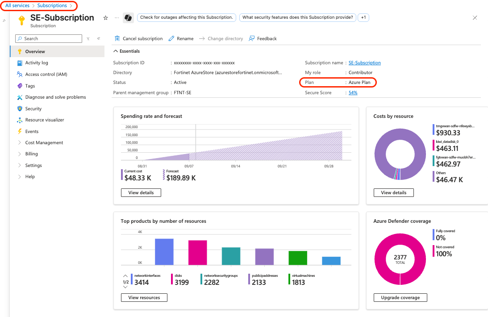
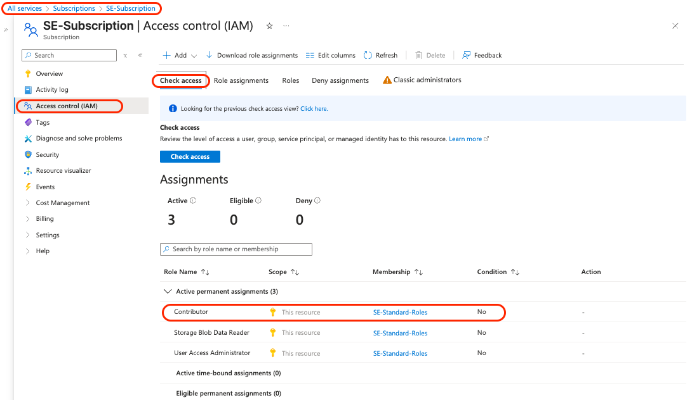
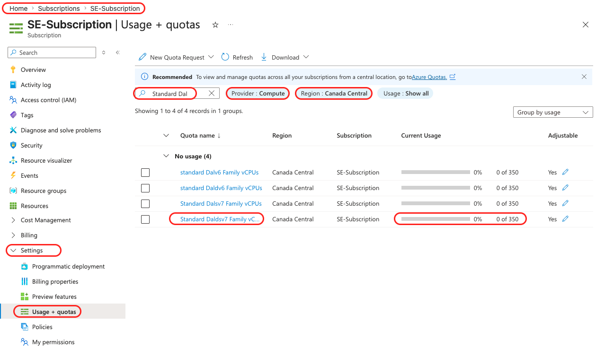

# Getting Started

## Azure Environment Setup and Verification

### Overview

Before we begin building, we need to ensure your Azure environment is properly configured. This lab will guide you through verifying your subscription access, checking resource quotas, and setting up cost controls.

### Prerequisites

- Active Azure subscription (Pay-as-you-go or Enterprise Agreement)
- Access to Azure Portal (portal.azure.com)
- Basic familiarity with Azure navigation

### Learning Objectives

By the end of this lab, you will have:

- Verified your Azure subscription permissions
- Confirmed sufficient resource quotas for the workshop

---

## Step 1: Verify Subscription Access

### 1.1 Log into Azure Portal

1. Navigate to [portal.azure.com](https://portal.azure.com)
2. Sign in with your Azure credentials
3. Once logged in, you should see the Azure Portal dashboard

### 1.2 Identify Your Subscription

1. In the Azure Portal, click on **"Subscriptions"** in the left navigation menu
   - If you don't see it, click on **"All services"** and search for **"Subscriptions"**
2. Note which subscription you'll be using for this workshop
3. **Important**: Ensure you're NOT using a production subscription

### 1.3 Check Subscription Type

1. Click on your subscription name
2. In the **Overview** section, check the **Plan** field:
   - ✅ **Recommended**: Azure Plan, Pay-As-You-Go, Visual Studio, Enterprise Agreement
   - ❌ **Not suitable**: Free Trial (has significant limitations)

### 1.4 Verify Permissions

1. Within your subscription, click on **"Access control (IAM)"**
2. Click **"View my access"**
3. Confirm you have one of these roles:
   - **Owner** (preferred)
   - **Contributor** (minimum required)

> [!WARNING]
> If you don't have Contributor or Owner permissions, contact your Azure administrator before proceeding.

---

## Step 2: Check Resource Quotas

### 2.1 Navigate to Usage + Quotas

1. In your subscription overview, click on **"Settings > Usage + quotas"** in the left menu
2. Set the **Provider filter** to **"Compute"**
3. Set the **Location filter** to **"Canada Central"**

### 2.2 Verify Required Quotas

Check that you have sufficient quota for these resources in **Canada Central**:

| Resource Type | Required | Check Location |
| --------------- | ---------- | ---------------- |
| Standard Dalv6 Family vCPUs | 2+ | Search for "Standard Dalv6 Family vCPUs" |
| Standard BS Family vCPUs | 4+ | Search for "Standard BS Family vCPUs" |
| Standard Public IP Addresses | 4+ | Search for "Public IP Addresses - Standard" |

### 2.3 Request Quota Increase (If Needed)

If any quotas are insufficient:

1. Click on the quota item
2. Click **"Request increase"**
3. Submit a support request (this may take 1-2 business days)

> [!NOTE]
> Most standard subscriptions have sufficient quotas by default. Free trials may require increases.

---

## Step 3: Environment Verification Checklist

Before proceeding to Lab 1, verify you have completed:

- [x] Confirmed subscription access with Contributor or Owner role
- [x] Verified sufficient quotas in Canada Central region

---

## Troubleshooting Common Issues

### Issue: Can't see Subscriptions menu

**Solution**: You may not have sufficient permissions. Contact your Azure administrator.

### Issue: Quota limits are too low

**Solution**: Submit a quota increase request through the Azure Portal. This typically takes 1-2 business days.

---

## Next Steps

Once you've completed this lab and verified all prerequisites, you're ready to proceed to [**Lab 1: Hub VNet Infrastructure and FortiGate HA Deployment**](/az-102-lab1/README.md).

**Estimated completion time**: 45 minutes

> [!TIP]
> Keep the Azure Portal open in a separate browser tab throughout the workshop for easy navigation between modules.
